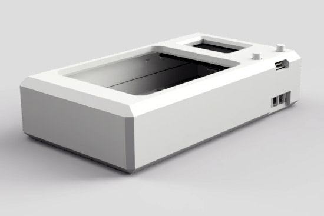
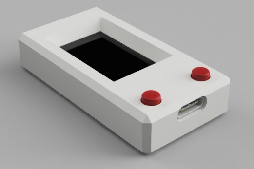

LNbits Hardware Wallet Enclosures
====
There are two varieties of the LNbits Hardware Wallet. One which must be connected to a computer for communication and signing transactions, another which uses a microSD card to sign PSBTs.

This directory contains STL files for both the USB and air-gapped HWWs.

+ [hww](hww) contains the STL files for the air-gappable HWW with microSD card slot
+ [hww-mini](hww-mini) contains the STL files for the HWW which uses a USB connection

## HWW

## HWW Mini

